### Git学习笔记

# Git 工作区、暂存区和版本库

------

## 基本概念

我们先来理解下 Git 工作区、暂存区和版本库概念：

- **工作区：**就是你在电脑里能看到的目录。
- **暂存区：**英文叫 stage 或 index。一般存放在 **.git** 目录下的 index 文件（.git/index）中，所以我们把暂存区有时也叫作索引（index）。
- **版本库：**工作区有一个隐藏目录 **.git**，这个不算工作区，而是 Git 的版本库。

下面这个图展示了工作区、版本库中的暂存区和版本库之间的关系：


### 常用命令图解


##### 1.查看Git配置命令

```bash
#列出所有配置
git config --list
#查看指定配置
git config user.name
```

##### 2.git一般使用流程

- 克隆 Git 资源作为工作目录。
- 在克隆的资源上添加或修改文件。
- 如果其他人修改了，你可以更新资源。
- 在提交前查看修改。
- 提交修改。
- 在修改完成后，如果发现错误，可以撤回提交并再次修改并提交。

##### 3.git配置文件修改

- 项目级配置文件位置：指定项目的.git下的config

  使用配置语句：

  ```bash
  git config user.name="qian"
  ```

  

  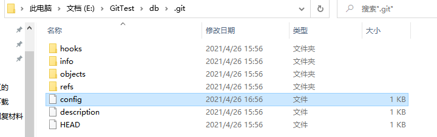

- 全局级配置文件，在用户目录下的.gitconfig文件里

  ```bash
  --global
  ```

  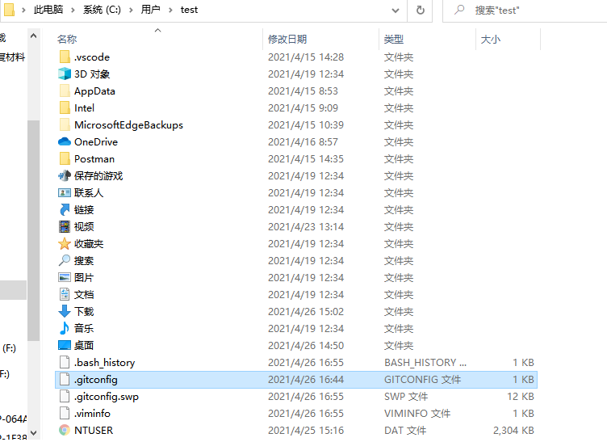

- 系统级配置文件，在Git安装目录下的gitconfg文件里

  ```bash
  --system
  ```

  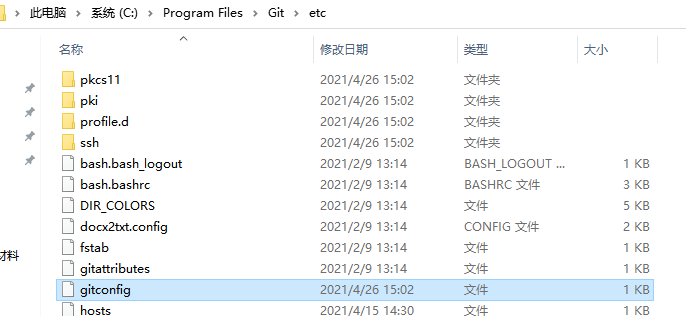

层次：系统>全局>项目，按照低层的来

##### 4.Git删除指定配置

```bash
git config --unset user.name
```

##### 5.Git克隆

可以不写路径，则克隆到当前文件夹；

可以写相对路径，也可以写绝对路径；

```bash
git clone <repo> <directory>
$ git clone git://github.com/schacon/grit.git
$ git clone git://github.com/schacon/grit.git mygrit
```

##### 6.编辑配置文件

```bash
$ git config -e    # 针对当前仓库 
$ git config -e --global   # 针对系统上所有仓库
```

##### 7.git建立与github远程仓库的连接，并拉取项目

```bash
#git remote add [简要名称] 				[github上的用户名称]/[远程仓库名称.git]
$ git remote add origin git@github.com:qianhao-zjut/Demo1.git
#拉项目，会将Demo1中的文件拉取到本地仓库(不是工作区)
$ git fetch origin master
#合并分支，然后拉取的文件会存在工作区
$ git merge origin/master
```

### git与github在IDEA中的使用

配置教程：https://blog.csdn.net/qq_40563761/article/details/91347443

##### 新建项目添加到github远程仓库

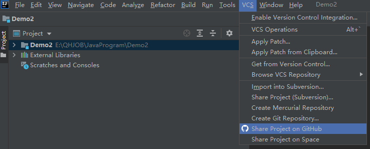

会让你设置仓库的名称，描述，远程连接别名，点击sheare就可以发布到github上

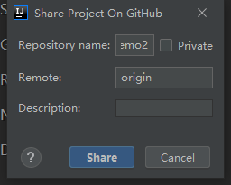

选择你想分享的文件，点击add，就会在github上创建指定的远程仓库，并把文件发布上去

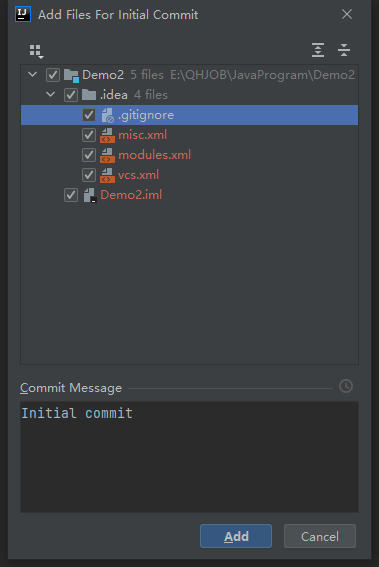

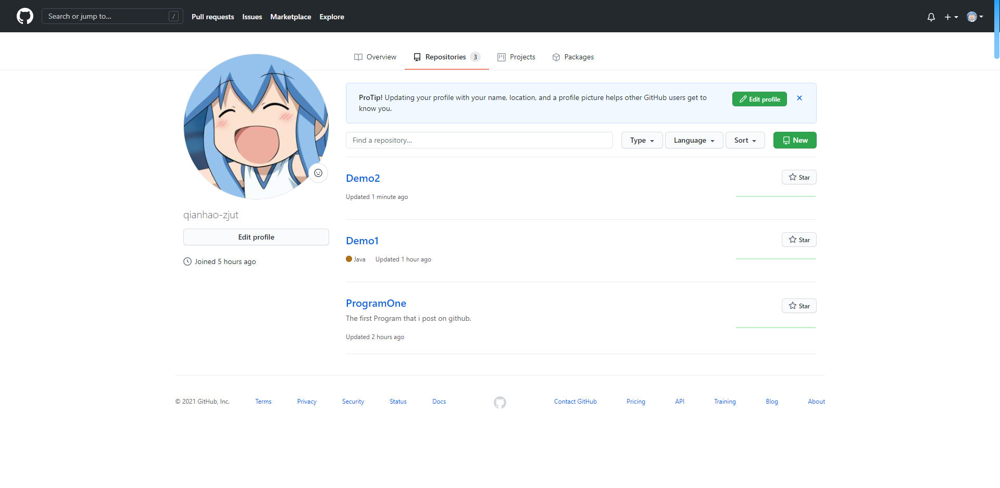

##### 本地项目创建新文件，修改文件同步到github

新建一个Test1.java

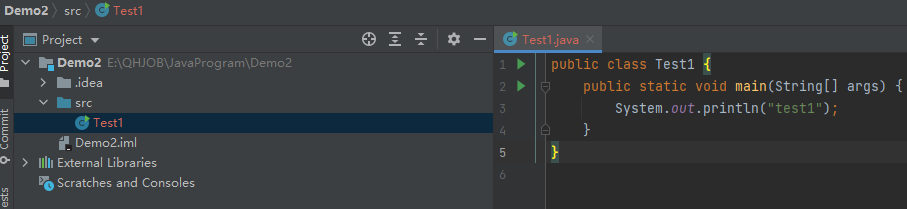

add到缓存区

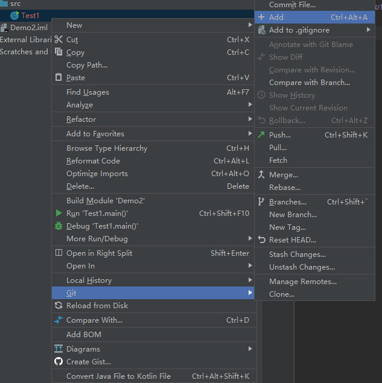

commit到本地仓库

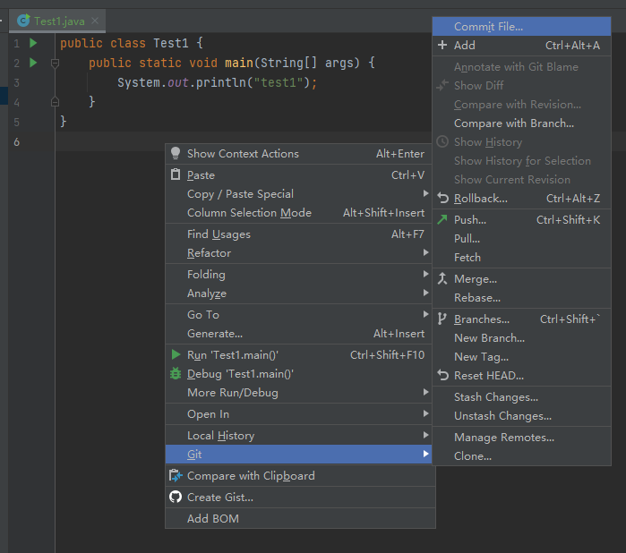

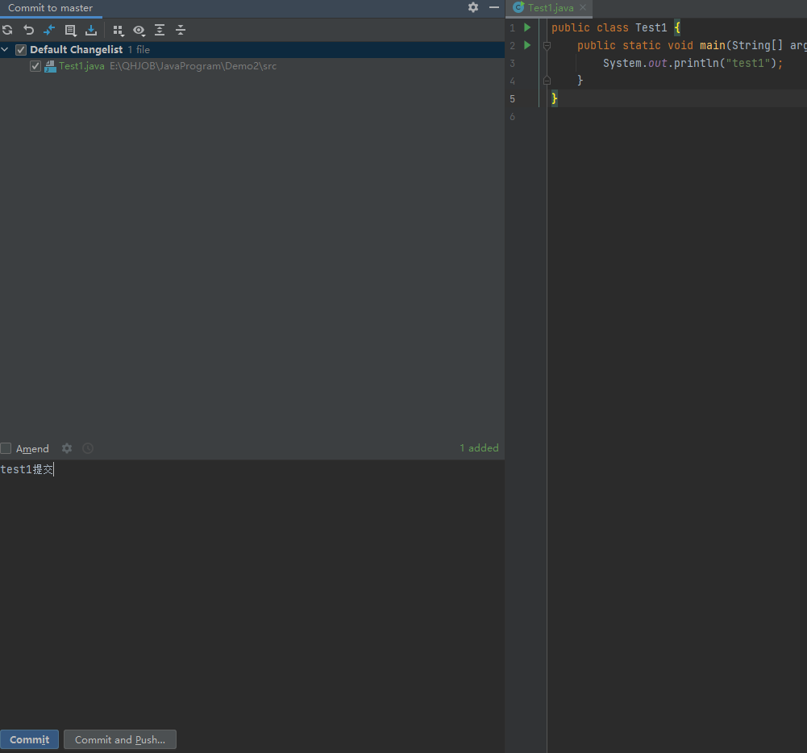

push到远程仓库

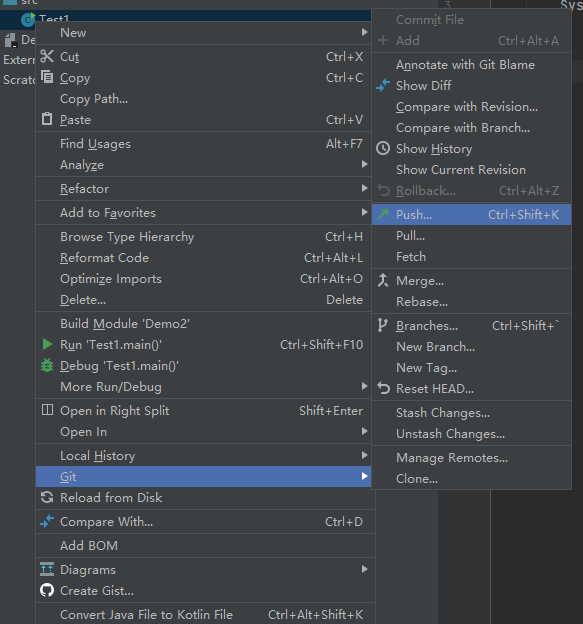

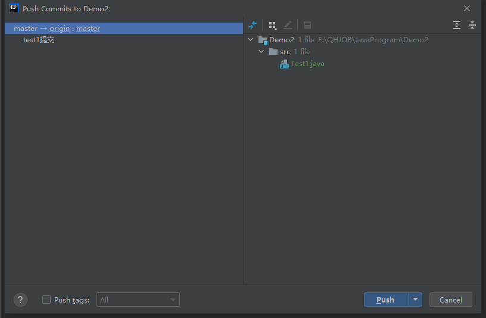

就可以在github中找到，提交的文件

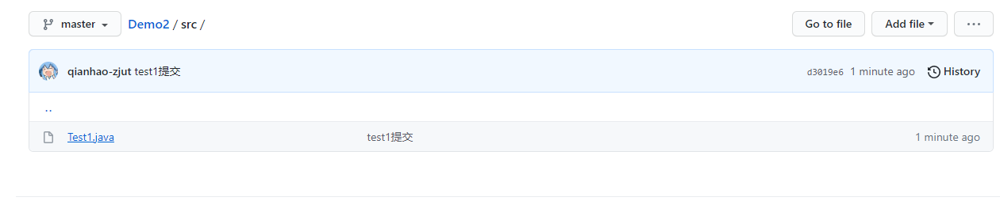

##### 修改文件之后，git查看修改之后的差异

使用git diff 查看本地仓库（add+commit之后保存的文件）与当前文件（工作空间，即使执行add操作，但没有commit也是工作空间）的差异

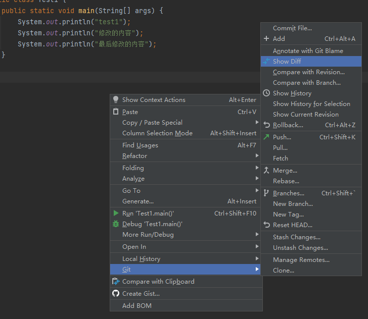

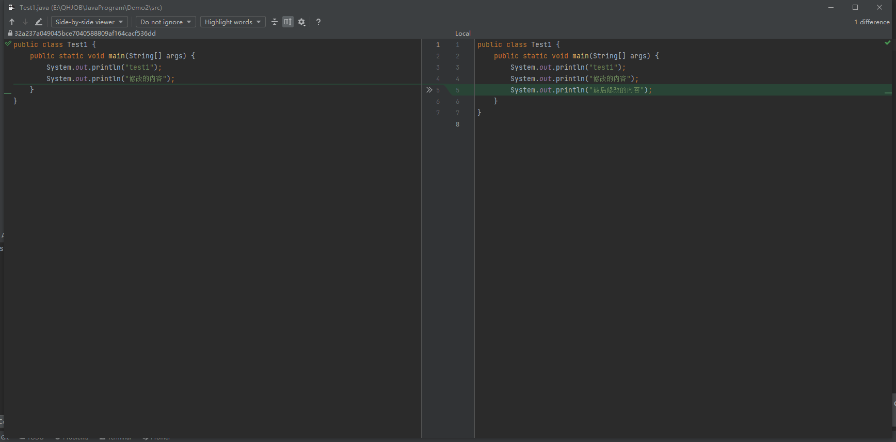

##### 版本比较与查看历史

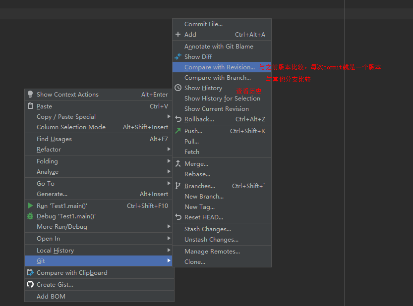

### 解决问题：

$ git push origin master Connection reset by 192.30.255.112 port 22 fatal: Could not read from remote repository.

方法：ping github.com之后再push

### Git常用的场景

https://www.cnblogs.com/javabg/p/8567790.html

