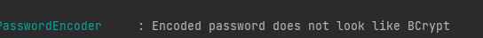

### SpringSecurity在SpringBoot中的使用

SpringSecurity主要有两部分内容：

- 认证 （你是谁，说白了就是一个用户登录的功能，帮我们验证用户名和密码）
- 授权 （你能干什么，就是根据当前登录用户的权限，说明你能访问哪些接口，哪些不能访问。）

> 这里的登录是对于浏览器访问来说的，因为如果是前后端分离时，使用的是Token进行授权的，也可以理解为登录用户，这个后边会讲。这里只是为了知识的严谨性才提到了这点

##### 流程图


教程1，简单明了：https://www.cnblogs.com/youngdeng/p/12869018.html

教程2，配置自定义页面，多步改造：https://www.jianshu.com/p/defa75b65a46

B站视频教程：[【尚学堂】SpringSecurity安全管理框架_spring security框架从入门到实战_Spring Security源码解析_哔哩哔哩 (゜-゜)つロ 干杯~-bilibili](https://www.bilibili.com/video/BV1R54y1a7Cv)

相关链接：[Spring Security-安全管理框架 - 知乎 (zhihu.com)](https://zhuanlan.zhihu.com/p/349962352)

##### 笔记：

##### 1.配置自定义登录页面等

##### 2.设置指定的登录密码

##### 3.设置数据库中的用户：还没有实现


#### 遇到的问题

##### 1.Authority,Role的区别，就是权限控制时，如果采用.hasRole("USER"),那么前面添加权限的时候，就要带ROLE_前缀，例如：“ROLE_ADMIN"，使用.hasAuthority("USER")就不用添加前缀。

详情参考：[spring security中Authority、Role的区别_小马的专栏-CSDN博客](https://blog.csdn.net/cngkqy/article/details/102919820)

##### 2.密码加密问题

采用Dao验证方式，既：

```java
@Override
public void configure(AuthenticationManagerBuilder auth) throws Exception {
    auth
            /*.inMemoryAuthentication()
            .passwordEncoder(passwordEncoder())
            .withUser("admin").password(passwordEncoder().encode("123456")).roles("ADMIN")
            .and()
            .withUser("test").password(passwordEncoder().encode("test123")).roles("USER")
            .and()*/
            //用户认证处理
           .userDetailsService(userDetailsService);//采用这个验证
            //密码处理
            //.passwordEncoder(passwordEncoder());

            //.authenticationProvider(provider);//采用表单验证
}
```

此时数据库的密码必须加密，不然会报错



因为我们在SecurityConfig中注入了加密方式

```java
@Bean
public PasswordEncoder passwordEncoder(){
    return new BCryptPasswordEncoder();
}
```

当我们使用自定义的认证方式时，解决密码加密问题：

- 前端密码与后端密码都不加密，然后字符串是否相等判断

- 后端加密，前端不加密时，用下面语句去判断

  ```java
  boolean flag=passwordEncoder.matches(password,userInfo.getPassword());//使用加密之后匹配
  ```

#### 使用流程

1.pom文件中添加依赖

```xml
<dependency>
			<groupId>org.springframework.security</groupId>
			<artifactId>spring-security-test</artifactId>
			<scope>test</scope>
		</dependency>
```

2.创建SecurityConfig配置类，继承WebSecurityConfigurerAdapter

在配置类中配置过滤条件：就是资源与角色的对应关系

- 配置访问权限http请求权限，可以配置自定义login，error,success等页面的路径

  ```java
  @Override
      protected void configure(HttpSecurity http) throws Exception {
          http
                  // 关闭csrf防护
                  .csrf().disable()
                  .headers().frameOptions().disable()
                  .and();
          http
                  //登录处理,自定义登录页面
                  .formLogin() //表单方式，或httpBasic
                  .loginPage("/loginPage")
                  .loginProcessingUrl("/login")
                  .defaultSuccessUrl("/index") //成功登陆后跳转页面
                  .failureUrl("/loginError")
                  .permitAll()
                  .and();
          http
                  .authorizeRequests() // 授权配置
                  //无需权限访问
                  .antMatchers( "/css/**", "/error404").permitAll()
                  .antMatchers("/user/**").hasRole("USER")
                  //其他接口需要登录后才能访问
                  .anyRequest().authenticated()
                  .and();
      }
  ```

  

- 配置验证方式：可以采用自定义的验证方式

  ```java
   @Override
      public void configure(AuthenticationManagerBuilder auth) throws Exception {
          auth
                  /*.inMemoryAuthentication()
                  .passwordEncoder(passwordEncoder())
                  .withUser("admin").password(passwordEncoder().encode("123456")).roles("ADMIN")
                  .and()
                  .withUser("test").password(passwordEncoder().encode("test123")).roles("USER")
                  .and()*/
                  //用户认证处理
                //上次  .userDetailsService(userDetailsService);//采用这个验证
                  //密码处理
                  //.passwordEncoder(passwordEncoder())
  
                  .authenticationProvider(provider);//采用表单验证
      }
  ```

  其中provider是我们自定义的权限验证类

  

3.实现自定义验证方式(可以用来获取表单数据)

创建自定义验证权限类MyAuthenticationProvider实现AuthenticationProvider，可以在其中验证是否登录成功

其中有两个主要方法

方法一：

authenticate：可以用来获取登录表单中的身份信息，并从UserDetails类中获取用户的正确信息，然后核对

如果登录成功，则会生成token，负责返回null

supports：配置支持的验证方式

```java
@Component
public class MyAuthenticationProvider implements AuthenticationProvider {

    /**
     * 注入我们自己定义的用户信息获取对象
     */
    @Autowired
    private MyUserDetailsService userDetailsService;

    @Autowired
    private PasswordEncoder passwordEncoder;

    @Override
    public Authentication authenticate(Authentication authentication) throws AuthenticationException {
        //从表单获取的用户信息
        String userName=authentication.getName();
        String password=(String)authentication.getCredentials();
        System.out.println("name:"+userName);
        System.out.println("password:"+password);
        //从后台获取的数据并，我们自己赋予权限的用户信息
        UserDetails userInfo=userDetailsService.loadUserByUsername(userName);
        if(userInfo==null){
            System.out.println("用户名不对");
            throw new BadCredentialsException("用户名不存在");
        }
        System.out.println("right pw:"+userInfo.getPassword());
        boolean flag=passwordEncoder.matches(password,userInfo.getPassword());//使用加密之后匹配
        //boolean flag=password.equals(userInfo.getPassword());
        if (!flag) {
            System.out.println("密码不对");
            throw new BadCredentialsException("密码不正确");
        }

        Collection<? extends GrantedAuthority> authorities = userInfo.getAuthorities();
        // 构建返回的用户登录成功的token
        return new UsernamePasswordAuthenticationToken(userInfo, password, authorities);
    }

    @Override
    public boolean supports(Class<?> authentication) {
        return authentication.equals(UsernamePasswordAuthenticationToken.class);
    }
}
```

4.编写UserDetails的实现类，在其中查询数据库是否存在用户，并且赋予正确权限

```java
@Configuration
public class MyUserDetailsService implements UserDetailsService {
        /**
         * 这个方法要返回一个UserDetails对象
         * 其中包括用户名，密码，授权信息等
         *
         * @param username
         * @return
         * @throws UsernameNotFoundException
         */
        @Override
        public UserDetails loadUserByUsername(String username) throws UsernameNotFoundException {
            System.out.println("come====>");
            if(username.equals("qh")){//在数据库中查询
                System.out.println("gggg");
                return new User(username, "123", AuthorityUtils.commaSeparatedStringToAuthorityList("ROLE_USER"));//授权
            }

            else
                return null;
            }
            
    }
```