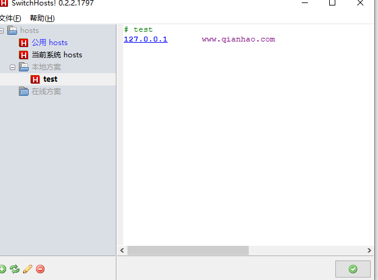

### SwitchHosts使用

##### 1.switchhosts作用

host是一个没有扩展名的系统文件，可以用记事本等工具打开，其作用就是将一些常用的网址域名与其对应的IP地址建立一个关联“数据库”，当用户在浏览器中输入一个需要登录网址时，系统会首先自动从Hosts文件中寻找对应的IP地址，一旦找到，系统会立即打开对应网页，如果没有找到，则系统再会将网址提交DNS域名解析服务器进行IP地址的解析。hosts文件的作用如下：1、加快域名解析对于要经常访问的网站，可以通过在Hosts中配置域名和IP的映射关系，这样当输入域名计算机就能很快解析出IP，而不用请求网络上的DNS服务器。2、方便局域网用户在很多单位的局域网中，会有服务器提供给用户使用。但由于局域网中一般很少架设DNS服务器，访问这些服务要输入难记的IP地址，对不少人来说相当麻烦。现在可以分别给这些服务器取个容易记住的名字，然后在Hosts中建立IP映射，这样以后访问的时候输入这个服务器的名字就行了。3、屏蔽网站现在有很多网站不经过用户同意就将各种各样的插件安装到计算机中，有些说不定就是木马或病毒。对于这些网站可以利用Hosts把该网站的域名映射到错误的IP或自己计算机的IP，这样就不用访问了。在Hosts写上以下内容：127.0.0.1#屏蔽的网站0.0.0.0#屏蔽的网站这样计算机解析域名就解析到本机或错误的IP，达到了屏蔽的目的。

##### 2.switchhosts使用

需要管理员权限运行

系统的hosts文件不能设置为只读

设置映射，然后切换运行即可

使用网站访问

##### 3.使用nginx消去端口号

教程：https://blog.csdn.net/weixin_38943098/article/details/880528

##### 4.switchhosts与nginx的区别

- 两个都可以实现Ip与域名的匹配，原理不一样，switch是通过匹配，通过修改系统的hosts文件，而nginx是通过反向代理

- switch不能消去端口号，ngnix可以
- switch在使用后即使退出，之前的设置也可以生效，因为是通过修改hosts文件，而ngnix退出之后，反向代理就会失效